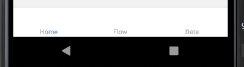
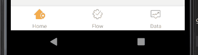

# React Navigation

> 社区今后主推的方案是一个单独的导航库react-navigation，它的使用十分简单。React Navigation 中的视图是原生组件，同时用到了运行在原生线程上的Animated动画库，因而性能表现十分流畅。此外其动画形式和手势都非常便于定制。

[官网](https://reactnavigation.org/)

## 安装依赖
1. react native的基础依赖
```
npm install @react-navigation/native
或者
yarn add @react-navigation/native
```

2. 进一步安装
```
npm install react-native-reanimated react-native-gesture-handler react-native-screens react-native-safe-area-context @react-native-community/masked-view
或者
yarn add react-native-reanimated react-native-gesture-handler react-native-screens react-native-safe-area-context @react-native-community/masked-view
```

3. 引入`import 'react-native-gesture-handler';`, 在`app.js`里的最上面

4. 基本依赖安装完毕

----

## tab路由
1. 安装依赖
```
npm install @react-navigation/bottom-tabs
或者
yarn add @react-navigation/bottom-tabs
```

2. 使用方法如下
默认设置`tab`



```javascript
import * as React from 'react';
import { Text, View } from 'react-native';
import { NavigationContainer } from '@react-navigation/native';
import { createBottomTabNavigator } from '@react-navigation/bottom-tabs';
// 导入路由页面
import Home from 'xxx/home';
import Flow from 'xxx/flow';
import Data from 'xxx/data';

const Tab = createBottomTabNavigator();

export default function App() {
  return (
    <NavigationContainer>
      <Tab.Navigator>
        <Tab.Screen name="Home" component={Home} />
        <Tab.Screen name="Flow" component={Flow} />
        <Tab.Screen name="Data" component={Data} />
      </Tab.Navigator>
    </NavigationContainer>
  );
}
```

自定义设置`tab`路由, 更多设置详见[bottom-tab-navigator](https://reactnavigation.org/docs/bottom-tab-navigator/)



```javascript
<NavigationContainer>
  <Tab.Navigator
    screenOptions={({ route }) => ({
      tabBarIcon: ({ focused, color, size }) => {
        let iconName;
        if (route.name === 'Home') {
          iconName = focused ? 'home-selected' : 'home';
        } else if (route.name === 'Flow') {
          iconName = focused ? 'flow-selected' : 'flow';
        } else{
          iconName = focused ? 'data-selected' : 'data';
        }
        return <Icon iconName={iconName}/>;
      },
    })}
    tabBarOptions={}
  >
    <Tab.Screen name="Home" component={Home} />
    <Tab.Screen name="Flow" component={Flow} />
    <Tab.Screen name="Data" component={Data} />
  </Tab.Navigator>
</NavigationContainer>
```

## stack路由
todo

## 抽屉路由
todo