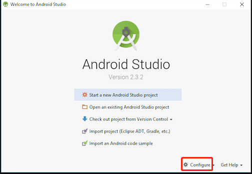
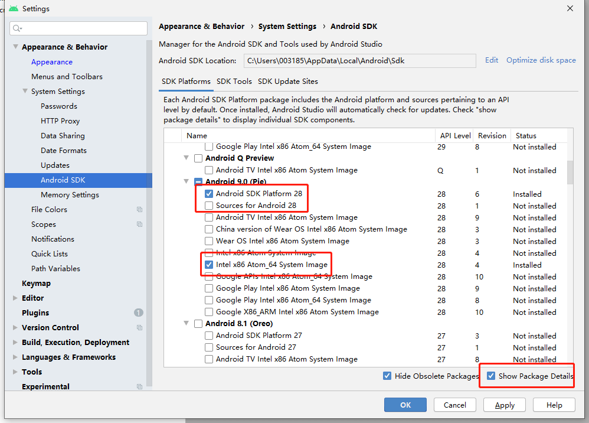
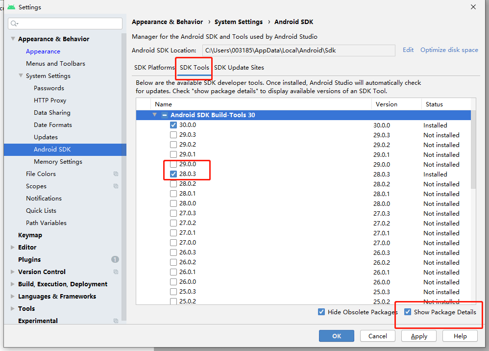
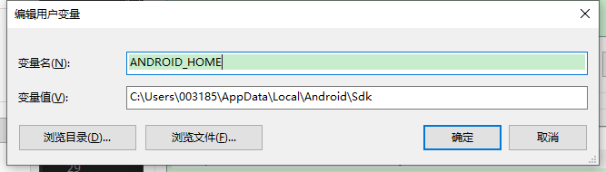
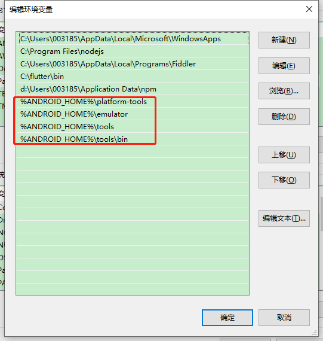

# 搭建开发环境

> `react native`以地狱般搭建开发者环境而劝退开发者而著称(特指`windows`), 不过说实话, 本人在2台`windows`上面搭建开发环境, 一天之内全搞定, 所以也不是那么的恐怖

### 1.搭建开发环境须知
1. 良好的网络环境(可以翻墙, 速度较快)
2. 耐心安装, 等待, 排错

### 2.安装依赖
1. `node`(>=**12**)
2. `Python2`(**必须2.x**)
3. `Java SE Development Kit` (JDK, 必须为**1.8**)

>注意: 不要使用 `cnpm`！`cnpm` 安装的模块路径比较奇怪，`packager` 不能正常识别！

### 3.搭建`windows-Android`开发换
1. 下载和安装`Android Studio`(自定义安装的时候选中如下几项, 不完全对应, 但是可以看到基本符合)
   1. Android SDK
   2. Android SDK Platform
   3. Performance (Intel ® HAXM)
   4. Android Virtual Device
2. 安装 `Android SDK`, 安装`Android Studio`的时候默认安装了`sdk`, 路径在`c:\Users\你的用户名\AppData\Local\Android\Sdk`
3. 进入`Android Studio`的欢迎界面



4. 分别勾选下面截图的选项, `SDK Platforms`和`SDK Tools` 选项卡, 点击`apply`, 进行下载安装(如果已经勾选的, 可以不用管, 确保选中图里的)




5. 配置 `ANDROID_HOME` 环境变量, 打开`控制面板` -> `系统和安全` -> `系统` -> `高级系统设置` -> `高级` -> `环境变量` -> `新建`，创建一个名为`ANDROID_HOME`的环境变量（系统或用户变量均可），指向你的 `Android SDK` 所在的目录（具体的路径可能和下图不一致，请自行确认）：



6. 添加其他环境变量`Path `, 打开`控制面板` -> `系统和安全` -> `系统` -> `高级系统设置` -> `高级` -> `环境变量`，选中`Path`变量，然后点击编辑。点击新建然后把这些工具目录路径添加进去：`platform-tools`、`emulator`、`tools`、`tools/bin`



###  4.新建项目
```
(先卸载可能之前安装的, 避免冲突)
npm uninstall -g react-native-cli 
npm install -g react-native-cli
(npx是node自带的命令, 安装最新版react native, 撰写文档的时候是0.62.2)
npx react-native init AwesomeProject 
```

### 5.运行项目

> 第一次运行会下载很多依赖, 请耐心等待, 如有报错, 还请`google`

```
cd AwesomeProject
npm run android
# 或者
yarn Android (取决于你安装了没有)
```

### 6.展示项目

