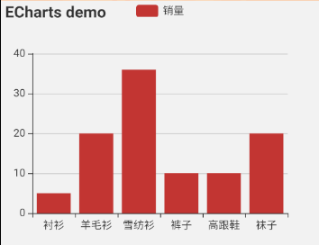

# 使用`echarts`的一些坑

### 当前版本
```
react:16.11.0
react-native:0.62.2
```

#### 别人探索的解决方案, 可能每个人不一样, 仅供参考, 最好每执行一次就`run`一下, 看是哪里的错误, 然后有针对性的下药

## 按照常理安装`echarts`, 接着发现报错(原因就是没有跟着rn更新)
```
Invariant Violation: WebView has been removed from React Native. It can now be installed and imported from 'react-native-webview' instead of 'react-native'. See 'https://github.com/react-native-community/react-native-webview'.
```
大致意思就是`WebView`不在从`react-native`里面`import`了, 改从`react-native-webview`, 这不是坑爹吗?

>`echarts`的`rn`版本更新也是一年前, 要么换要么改一下源码, 或者等它更新

```
if(换图表 || 等更新){
  可以不用往下看了
}else{
  继续往下看
}
```

>以下方案均`google`而来

- . 找到`native-echarts`的目录`\node_modules\native-echarts\src\index.js`, 同样`\node_modules\native-echarts\src\components\Echarts\index.js`

**当然还得在`native-echarts`执行一下安装命令`npm install react-native-webview`**
```
原先是这样import的
import { WebView } from 'react-native';
换一下
import { WebView } from 'react-native-webview';
```

- . 打开`Android studio`,找到`file`-`settings`-`sdk tool`-勾选上`29.0.3`-点击`apply`, 回到项目里`\android\build.gradle`, 修改
```
ext {
  buildToolsVersion = "29.0.3"
  compileSdkVersion = 29
}
```

- . 回到`\node_modules\native-echarts\src\components\Echarts\index.js`,改一下`webview`里面的写法

**记住要把这个tpl文件复制一份到`\android\app\src\main\assets`, 如果没有目录, 那就新建一个**
```
原先是这样写的
source={require('./tpl.html')}
改为
source={Platform.OS === 'ios' ? require('./tpl.html') : { uri: "file:///android_asset/tpl.html" }}
```
- . 重新`run`, 截图如下:

